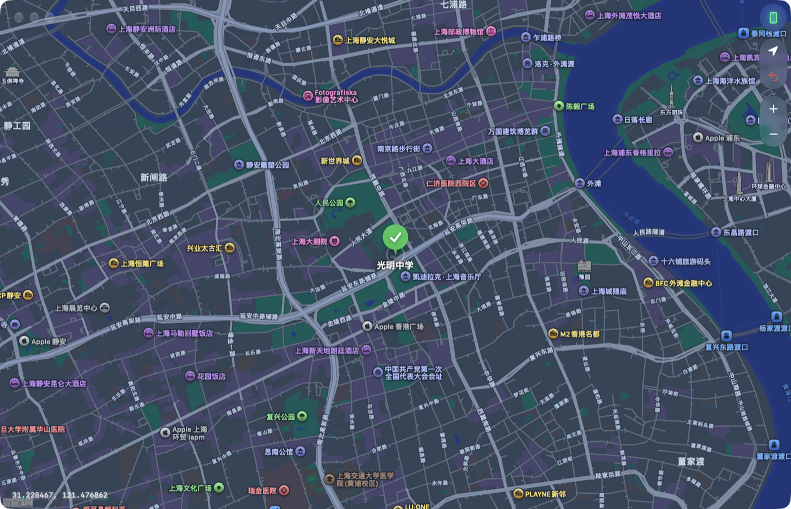

# LocPilot

> 点一下地图，把 iPhone 的定位传送到那里。

**原生 macOS App**（SwiftUI + MapKit + 系统 Liquid Glass）· 类 [iAnyGo](https://www.tenorshare.com/products/ianygo.html) 的 iOS 虚拟定位工具 · iOS 17+ 走 RemoteXPC/DTX 隧道、默认**免 sudo** · **无需越狱**

**中文** | [English](README.en.md)


**下载**：[⬇️ 最新安装包（Apple Silicon / arm64，ZIP）](../../releases/latest)

> ⚠️ **合规提示**：本工具修改的是设备**系统级**定位，仅用于自测、演示与开发调试。请勿用于作弊、绕过风控或任何违反服务条款与法律的用途。

## 项目介绍

### 它是什么

LocPilot 把「我这台 iPhone 现在在哪」变成地图上随手一点的事：USB 连上手机，点地图任意位置，设备定位就过去了 —— **不需要越狱，也不需要在手机上装任何东西**。

它由两层组成，职责刻意分开：

* **原生 macOS App**（SwiftUI + MapKit）：界面只有三样东西 —— Apple 地图、右上控件簇、左下坐标读数。全面屏、无标题栏硬边，控件用系统 Liquid Glass 材质（旧系统自动回落材质）。
* **Python 后端**（App 自动拉起，也能独立跑）：真正干活的定位引擎适配层，同时对外提供 **HTTP/SSE API 与 CLI**。所以多点路线、GPX 回放、速度控制、地址搜索、历史这些复杂能力都长在后端，App 只依赖它的 HTTP 契约。



*截图：原生界面 —— Apple 地图本体、右上玻璃控件簇、左下坐标读数；落针后显示反查到的地名。此图为内置 mock 引擎演示，未连接真机。*

### 为什么是原生的

同类工具（iAnyGo 等商业软件）大多是 Windows / Electron 形态：自带运行时、自带地图瓦片、界面与引擎焊死在一起。LocPilot 反着做 —— 界面用系统框架，地图用 Apple 地图本体（中国区即高德数据源），定位能力交给成熟开源引擎：**换引擎不用动界面，改界面不用动引擎**。

### 核心特性

| 特性 | 说明 |
|------|------|
| 原生界面 | Apple 地图本体 + **系统原生手势**：触控板**双指拖动**平移、**双指捏合**缩放，手感与 macOS「地图」App 完全一致；深/浅色自动跟随、系统玻璃材质控件、全面屏无边框窗口 |
| 点击即传送 | 唯一交互。右上控件簇 = 连接状态 / 回到当前位置 / 恢复真实定位 / 缩放；快捷键 **⌘K** 连接 · **⌘⇧K** 断开 · **⌘⇧C** 恢复真实定位 |
| 引擎可插拔 | pymobiledevice3（默认）· libimobiledevice（仅 iOS ≤16）· go-ios · mock，按设备与系统版本自动选择 |
| 免 sudo 隧道 | iOS 17+ 走 RemoteXPC/DTX，macOS 上默认自动建立隧道、普通用户权限即可（只有持久/共享隧道才要 root） |
| 后端 API + CLI | 与 App 共用同一个 Session：单点传送、多点路线、GPX 导入导出、速度与循环模式、地址搜索、历史 |
| 不依赖 Xcode | SwiftPM 命令行构建（`bash macos/build.sh`），只装 Command Line Tools 也能产出 `LocPilot.app` |
| 自带体检 | 构建脚本内置打包结构自检、启动冒烟与崩溃守卫；无 iPhone 时可用 mock 引擎跑通全流程 |

### 技术栈

| 层 | 技术 |
|----|------|
| 原生 App | Swift 5.9 + SwiftUI + MapKit + Liquid Glass；SwiftPM 两个 target（LocPilotKit / LocPilotApp） |
| 后端 | Python ≥3.9，运行期只用标准库；引擎依赖按需装进仓库内 `.venv` |
| 通信 | REST + SSE（`/api/events`），事件流驱动界面状态 |
| 定位引擎 | pymobiledevice3 · libimobiledevice · go-ios · mock |
| 地图与地理 | MapKit · OSRM 路线规划 · Nominatim 地址检索 |

### 项目状态

**v1.0.1：功能已全部完成**，并提供 Apple Silicon（M 系列）原生安装包。原生 App 主链路（连接 / 传送 / 恢复 / 缩放）、四个引擎适配器、pymobiledevice3 常驻 worker、多点路线与 GPX、后端 API 与 CLI 均已跑通。已知限制见 [第 7 节](#7-已知限制务必先读)。

---

## 1. 界面

主窗口只有三样东西：地图、右上控件簇、左下坐标读数。

| 控件 | 作用 |
|------|------|
| 📱 手机图标 | 连接状态：连上后绿色泛光；点击 = 连接 / 断开。悬停显示设备名 |
| ➤ 定位箭头 | 回到当前（虚拟）位置 |
| ⤴ 恢复真实定位 | 清除虚拟定位，设备回到真实 GPS |
| ＋ / − | 放大 / 缩小（以当前可见跨度为基准） |

**手势就是系统地图的手势**：界面直接把 MapKit 本体当画布，只开平移与缩放两种交互 —— 触控板**双指拖动**平移、**双指捏合**缩放，惯性、回弹、缩放锚点全部由系统负责，跟 macOS「地图」App 一模一样。
这大概是整个工具**体验最自然**的地方：改定位不需要摇杆、不需要坐标输入框、不需要按钮面板，就是在地图上用两根手指挪一下。

快捷键：**⌘K** 连接 · **⌘⇧K** 断开 · **⌘⇧C** 恢复真实定位。

> 复杂功能（多点路线、GPX 回放、摇杆、历史、收藏、速度预设）保留在后端 HTTP API 与 CLI 中；原生界面刻意保持极简。

## 2. 快速开始

### 方式 A：直接下载使用（推荐，免构建）

**要求：Apple Silicon（M1 / M2 / M3 / M4 …）Mac + macOS 26 或更高** —— 本版以 macOS 26 SDK 构建，才能启用系统 Liquid Glass 新外观（用更低 SDK 构建会整体回落到旧版控件样式）。

1. 打开 **[Releases](../../releases/latest)**，下载 `LocPilot-1.0.1-arm64.zip`（约 470 KB）
2. 解压，把 **LocPilot.app** 拖进「应用程序」
3. **首次打开**：本版为 ad-hoc 签名（未做 Apple 公证），双击会被 Gatekeeper 拦一次 ——
   右键点 App →「打开」→ 弹窗里再点「打开」；或执行一次：

   ```bash
   xattr -dr com.apple.quarantine /Applications/LocPilot.app
   ```

4. **只有要改真机定位才需要装引擎**：菜单栏「引擎 → 安装 / 修复定位引擎…」（约 40MB，无需 sudo）。
   不装也能用内置 mock 虚拟设备把界面跑通
5. USB 连上 iPhone → 手机上点「信任此电脑」并开启开发者模式 → 点右上角手机图标连接 →
   **在地图上点一下**，大头针落下后定位即改到那里

> 包完整性校验：`shasum -a 256 LocPilot-1.0.1-arm64.zip`，结果应与 Release 页里的 SHA-256 一致。

### 方式 B：从源码构建

```bash
# 1) 安装定位引擎（创建 .venv 并安装 pymobiledevice3；App 本体不需要）
bash scripts/setup-engine.sh

# 2) 构建原生 App（SwiftPM，命令行即可，不需要 Xcode）
bash macos/build.sh              # 产物：macos/build/LocPilot.app
bash macos/build.sh --run        # 构建并启动

# 3) 打开 App，点右上角手机图标连接设备，然后点地图
```

无真机时用虚拟设备体验：

```bash
LOCPILOT_ENGINE=mock bash macos/build.sh --run
```

构建脚本参数：`--check`（只做 SwiftPM 预检）· `--selftest`（无界面自检 JSON）· `--smoke`（构建 + 打包结构自检 + 启动冒烟 + 崩溃守卫）· `--run` · `--no-build` · `--help`。

**环境变量**（App 与后端都认）：

| 变量 | 作用 |
|------|------|
| `LOCPILOT_ENGINE` | 指定引擎：auto（默认）/ mock / pymobiledevice3 / libimobiledevice / go-ios |
| `LOCPILOT_AUTOCONNECT` | `0` = 启动时不自动连接（自动化/验收用，避免误连真机） |
| `LOCPILOT_PYTHON` | 指定 Python 解释器（默认按 App 支持目录 → 仓库 .venv → Homebrew → 系统 顺序探测） |
| `LOCPILOT_APP_SUPPORT` | 重定向状态目录（CI / 便携模式） |
| `LOCPILOT_HOME` | 后端状态目录（历史、设置、runtime.json） |

## 3. CLI（与 App 共用同一个 Session）

```bash
python3 -m locpilot engines --probe                  # 引擎可用性与设备列表
python3 -m locpilot devices                          # 已连接设备
python3 -m locpilot set 31.2304 121.4737             # 单点传送
python3 -m locpilot clear                            # 恢复真实定位
python3 -m locpilot route --point 31.2304,121.4737 --point 31.2454,121.4987 --speed 6.9 --loop pingpong
python3 -m locpilot route --gpx track.gpx --speed 3  # GPX 回放
python3 -m locpilot export-gpx --point 31.23,121.47 --point 31.24,121.48 --out route.gpx
python3 -m locpilot search 上海外滩                  # 地址搜索
python3 -m locpilot doctor                           # 环境自检（JSON）
python3 -m locpilot serve --port 8799                # 只跑后端（App 会自动拉起它）
```

常用参数：`--engine {auto,pymobiledevice3,go-ios,libimobiledevice,mock}`、`--udid`、`--json`、`--offline`。

## 4. 引擎与系统要求

| 引擎 | 适用 | 隧道 | 许可 | 说明 |
|------|------|------|------|------|
| **pymobiledevice3**（默认） | iOS ≤16 与 17+ | iOS 17+ 需要（默认自动建立，免 sudo） | GPL-3.0 | 常驻 worker 会话，支持高频更新；CLI 兜底 |
| libimobiledevice | **仅 iOS ≤16** | 不需要 | LGPL-2.1 | 走 `com.apple.dt.simulatelocation`；iOS 17 起该服务不可用，引擎会明确拒绝 |
| go-ios | iOS ≤16 与 17+ | `ios tunnel start --userspace` | MIT | 备选；实测结论：暂缓替换，需要闭源分发时再切 |
| mock | 任意 | — | 本项目 | 无设备演示与自动化验证 |

前置条件（真机）：USB 连接并在手机上「信任此电脑」；iOS 16+ 需开启**开发者模式**
（`idevicedevmodectl enable` 或 `pymobiledevice3 amfi enable-developer-mode`，需重启并输入锁屏密码）；首次使用建议 `python3 -m locpilot doctor --probe` 确认。

iOS 17+ 若自动隧道失败（例如 iOS 17.0–17.3），手动开一个共享隧道后重试：

```bash
sudo .venv/bin/pymobiledevice3 remote tunneld     # 仅共享/持久隧道才需要 root
```
## 5. 架构

```
macos/                     原生 App（SwiftPM 工程，命令行可构建，不需要 Xcode）
  Package.swift            LocPilotKit / LocPilotApp 两个 target
  Sources/LocPilotKit/
    BackendController.swift  后端守护：解释器探测、端口挑选、健康检查、日志转发、退出回收
    EngineClient.swift       REST + SSE 客户端（status / connect / disconnect / teleport / clear / events）
  Sources/LocPilotApp/
    LocPilotApp.swift        App 入口、菜单、启动画面、--selftest 入口
    AppState.swift           唯一状态源（连接状态 / 位置 / 相机），@Published 驱动界面
    MapScreen.swift          MapKit 地图 + 点击传送 + 坐标读数
    ControlsCluster.swift    右上玻璃控件簇（系统 .glassEffect，旧系统回落材质）
    WindowConfigurator.swift 全面屏窗口（推迟到下一 runloop 改窗口，避免布局期崩溃）
locpilot/                    Python 后端（App 通过 HTTP 驱动，也可独立使用）
  cli.py / server.py / api.py / config.py
  core/     geo · route · playback · gpx · places · store · session
  engine/   base · pmd3（含常驻 worker）· legacy · goios · mock
macos/build.sh               开发构建（产出 LocPilot.app）
macos/dist.sh                分发打包（清洗 + 重签名 + arm64 校验 + DMG + 校验和）
docs/images/                 README 用的界面截图
```

关键设计取舍：

1. **界面与引擎分离**：原生 UI 只依赖 `EngineClient` 的 HTTP 契约，引擎换代不影响界面。
2. **常驻 worker 而非每次 spawn CLI**：pymobiledevice3 的 `simulate-location set` 会阻塞在 SIGINT，每次改坐标都重启进程会反复建立隧道；worker 只建一次会话，之后一行 JSON 一次坐标。
3. **事件流驱动界面**：`/api/events` 是 SSE。注意 Foundation 的 `bytes.lines` **不产出空行**，SSE 分帧必须自己按字节切，否则事件流会静默失效（界面看着正常，实际全是死的）。
4. **不在布局期改窗口**：`WindowConfigurator` 把窗口配置推迟到下一个 runloop，并且**禁用一切 KVC 私有键** —— 两者都曾导致启动即闪退（SIGTRAP）。
5. **回放里程以几何为准**：OSRM 返回的道路里程只作参考，否则会出现「进度 100% 人还没到」。

## 6. 构建、自检与打包

```bash
# 原生层（零依赖测试运行器：Command Line Tools 没有 XCTest）
swift run --package-path macos LocPilotTests

# 构建 + 打包结构自检 + 启动冒烟 + 崩溃守卫（新增崩溃报告即失败）
bash macos/build.sh --smoke

# 无界面自检（JSON，CI 用）
bash macos/build.sh --selftest

# 出分发包：移除本机路径 + ad-hoc 重签名 + arm64 校验 + DMG + SHA-256
bash macos/dist.sh
```

产物在 `macos/build/dist/`：`LocPilot-<版本>-arm64.zip` + `.sha256` + `安装说明.txt`（优先出 DMG，环境不允许创建磁盘镜像时自动回落 ZIP）。
打包脚本会强制校验架构为 arm64、包内不含本机绝对路径，改过 Info.plist 后重新 ad-hoc 签名，最后解压到独立目录复核签名与 `--selftest`。

> 本机若只装了 Command Line Tools（无 Xcode）：`swift test` 不可用（没有 XCTest），也不能用 `@State` 等 SwiftUI 宏；
> SwiftPM 需加 `--disable-sandbox` 并把模块缓存指到工程内。

## 7. 已知限制（务必先读）

* **系统级生效**：改的是设备整体位置，不能只对单个 App 生效。
* **IP 不改变**：依赖 IP/Wi-Fi 定位的服务仍能看到真实地区。
* **可被检测**：CoreLocation 暴露 `isSimulatedBySoftware`，游戏与风控可能识别模拟定位；请勿用于破坏服务条款或作弊场景。
* **iOS 17+ 的定位随连接存活**：DVT 连接断开即恢复真实定位，所以必须保持 App / 服务运行。
* **iOS ≤16 的定位是设备侧状态**：进程退出后仍保持，需 `clear`（或重启）才恢复。
* 需要开发者模式与 Developer Disk Image；锁屏 / 未信任设备无法工作。
* 原生版地图由 MapKit 提供，需要联网（Apple 地图服务）。中国区数据源即高德，对外坐标仍是 WGS-84，**不需要自行做 GCJ-02 纠偏**。

## 8. 故障排查

| 现象 | 处理 |
|------|------|
| 未发现设备 | 换数据线 / USB 口；手机点「信任」；`python3 -m locpilot doctor --probe` |
| iOS 17+ 报隧道错误 | 运行 `sudo .venv/bin/pymobiledevice3 remote tunneld`，或 `--rsd HOST PORT` |
| `not supported on iOS 17+` | 用的是 libimobiledevice 引擎，切回 `--engine pymobiledevice3` |
| 启动即闪退 | 看 `~/Library/Logs/DiagnosticReports/LocPilot*`；两类历史原因：KVC 私有键、布局期改窗口 —— 都已修并有冒烟守卫 |
| 界面显示已连接但状态不刷新 | 事件流问题：确认 `EngineClient.events()` 按字节分帧（`bytes.lines` 会吞掉 SSE 空行） |
| 坐标下发失败后回放暂停 | 查后端日志与 `engine.error`；重连设备后用 CLI / API 继续 |
| `PermissionError: …/.pymobiledevice3` | 家目录不可写（沙箱 / CI / 只读 HOME）。引擎会自动退到 `<状态目录>/pmd3-home`，也可显式指定 `LOCPILOT_PMD3_HOME=/可写路径` |

## 9. 安全

默认只监听 `127.0.0.1`；`/api` 可加 `--token` 校验；静态资源做了目录穿越防护。
本工具会在本机执行设备控制命令，请勿把端口暴露到公网。

## 10. 状态目录与日志

* 状态目录：`~/Library/Application Support/LocPilot`（`runtime.json` 记录 pid / 端口 / 解释器）
* 后端日志：App 会转发后端 stdout/stderr；独立运行时在终端直接可见
* 菜单「引擎 → 打开状态目录」可直接在 Finder 打开

## 11. 许可与来源

LocPilot 以 **GPL-3.0** 发布：默认引擎 pymobiledevice3 为 GPL-3.0，本项目在其之上构建并导入其 Python API。
若改用 go-ios（MIT）引擎并移除 pymobiledevice3 适配层，可自行改为宽松许可。
第三方归属见 [NOTICE.md](NOTICE.md)。

## 12. 更新日志

每个版本修了什么、加了什么，见 **[CHANGELOG.md](CHANGELOG.md)**；安装包与 SHA-256 见 [Releases](../../releases)。

最近一版 **v1.0.1** 修掉了：窗口顶部悬停判定错位、红绿灯不显示 `× − +` 符号、首屏状态接口卡十几秒、无定位时左下角多出的横杠，并把系统控件外观切到新系统样式。

---

**问题 / Bug / 建议**：请提 [Issue](../../issues)，这样别人也能搜到答案。
